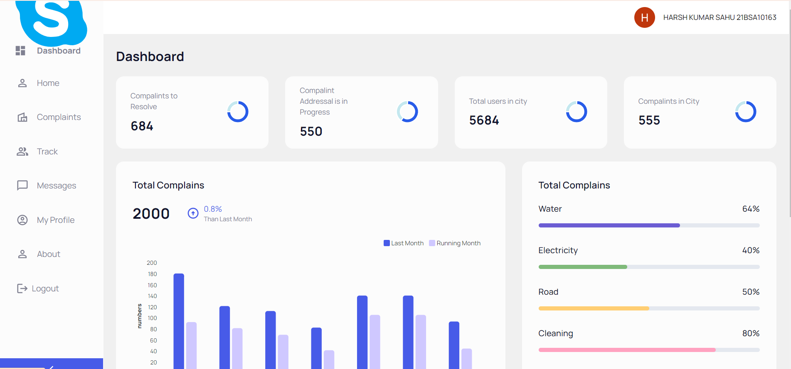
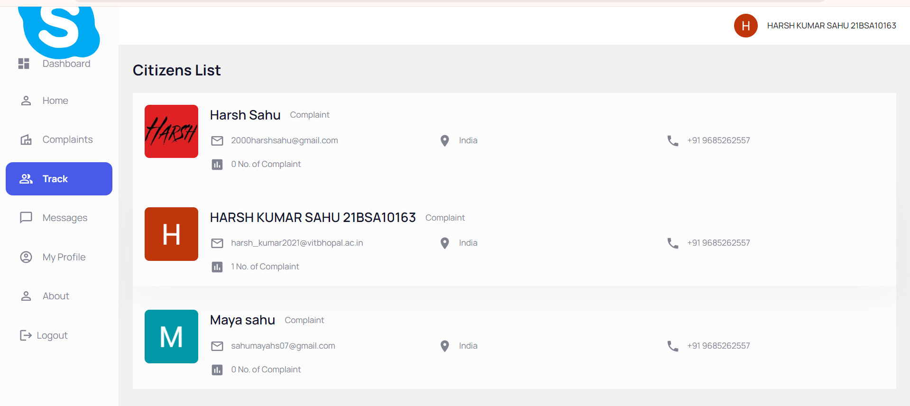
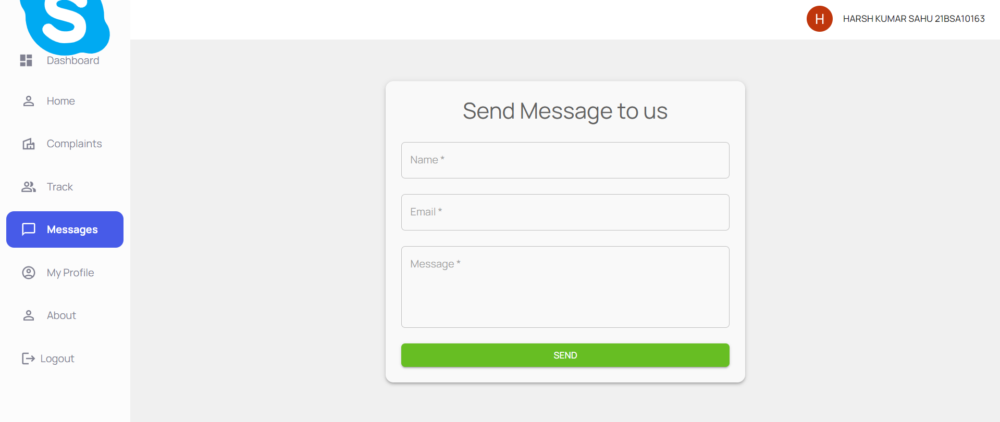

# Samadhan Portal

The **Samadhan Portal** is built to provide citizens with a platform where they can easily report and monitor city-related problems. The portal aims to bridge the gap between citizens and local authorities, ensuring that issues like electricity, water supply, road conditions, cleaning, and more are addressed promptly.

## Features

### Home
  
The **Home** section gives a brief overview of the city, including its history, key attractions, and current infrastructure. This helps users get acquainted with the city's background and understand the context of the services provided.

### City Issues
  
In the **City Issues** section, you can view a list of common problems related to city services. This static page provides an overview of recurring issues in different states, helping users identify the most pressing concerns that need attention.

### Register a Problem
  
Citizens can submit their issues directly through the **Register a Problem** section. This section includes a form where users can specify the type of problem, location, and other relevant details, ensuring that the authorities have all the necessary information to address the issue effectively.

### Registered People
The **Registered People** section lists all individuals who have reported issues. This promotes transparency and allows citizens to see the collective efforts being made to improve the city's conditions. It also fosters a sense of community and shared responsibility.

### Message Section
  
The **Message Section** allows citizens to communicate directly with the collectorate office. This feature helps in facilitating direct and efficient communication between the public and local authorities, ensuring that citizens' voices are heard and acted upon promptly.

### About
The **About** section provides information about the purpose of the Samadhan Portal, the mission behind it, and the team that developed it. This section helps users understand the vision and goals of the portal, as well as the people working behind the scenes to make it successful.

---

### Short Description

The **Samadhan Portal** is a civic engagement platform that empowers citizens to report and track city-related problems. It fosters direct communication between citizens and local authorities, promoting transparency and efficient problem-solving.

### Why I Made This

I created the **Samadhan Portal** to address the gap between citizens and local authorities in managing city-related issues. The portal aims to provide a streamlined and transparent process for reporting problems, ensuring that they are resolved in a timely manner. By enabling direct communication and providing visibility into the status of reported issues, the portal helps improve the overall quality of life in the city.
